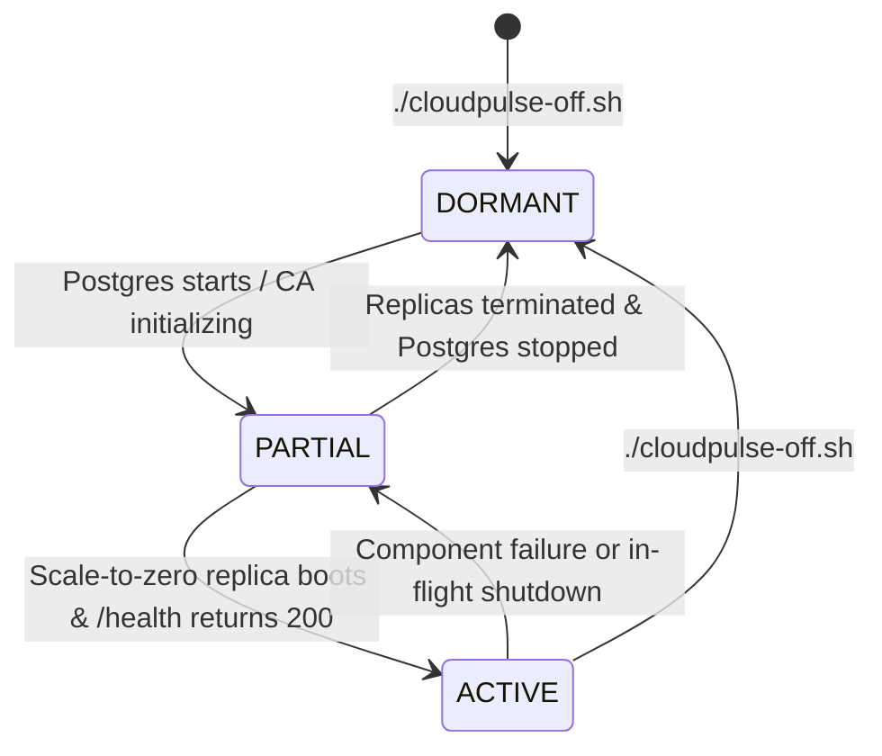

# CloudPulse Azure Lifecycle Management Guide

> **Production-Conscious, Idempotent ON / OFF / STATUS Operations for Azure Compute Cost Optimization**

---

## 1. Executive Summary & Core Invariants

CloudPulse is designed for high availability and autonomous threat detection, but during dormant periods (e.g., between triage cycles or outside demonstration windows), running dedicated cloud compute incurs unnecessary idle expenses.

This lifecycle management system provides deterministic, production-conscious lifecycle automation:
* **OFF Mode (`DORMANT`)**: Minimizes compute charges by setting Container App replicas to `0/0` (blocking ingress wake-up) and stopping the PostgreSQL Flexible Server.
* **ON Mode (`ACTIVE`)**: Restores dependencies in strict topological order (PostgreSQL first $\rightarrow$ Container App scaling $\rightarrow$ minimum activation $\rightarrow$ health verification), confirming end-to-end functionality before marking operational.
* **STATUS (`Read-Only`)**: Safely inspects and classifies deployment state without triggering mutations or waking scale-to-zero replicas.

```
                           ┌─────────────────────────┐
                           │   ./cloudpulse-off.sh   │
                           └────────────┬────────────┘
                                        │ (Min=0, Max=0; Stop PG)
                                        ▼
┌─────────────────────────┐        ┌─────────┐        ┌─────────────────────────┐
│   cloudpulse-status.sh  │ ────►  │ DORMANT │ ◄────  │   cloudpulse-status.sh  │
└─────────────────────────┘        └────┬────┘        └─────────────────────────┘
                                        │
                                        │ (Start PG; Restore 0/1; Activate)
                                        ▼
                           ┌─────────────────────────┐
                           │   ./cloudpulse-on.sh    │
                           └────────────┬────────────┘
                                        │
                                        ▼
┌─────────────────────────┐        ┌─────────┐        ┌─────────────────────────┐
│   cloudpulse-status.sh  │ ────►  │ ACTIVE  │ ◄────  │   cloudpulse-status.sh  │
└─────────────────────────┘        └─────────┘        └─────────────────────────┘
```

### Non-Negotiable Safety Invariants
1. **Zero Destructive Operations**: Lifecycle scripts **never** delete Azure resources, run `terraform destroy`, delete databases, purge storage accounts, remove ACR images, or drop resource groups.
2. **Infrastructure & Configuration Preservation**: Network Security Group rules, subnets, private DNS zones, managed identity assignments, and Terraform states remain 100% untouched.
3. **Strict Subscription Guard**: The active Azure subscription is matched against the target deployment ID (`90b900ea-4273-4b40-a343-091aecfe2911`). Silent context switching is strictly prohibited.
4. **Verified Transitions**: Operations poll with bounded timeouts and inspect actual Azure runtime state; no service is reported ready merely because an asynchronous dispatch command succeeded.
5. **No Secret Leakage**: Database credentials, tokens, or connection strings are never printed to terminal logs, outputs, or error traces.
6. **Safe Idempotency**: Repeated execution of ON or OFF at any point in the lifecycle is safe and side-effect free.

---

## 2. Required Tools & Azure Permissions

### Required Client Tools
* **Bash** (`bash >= 4.0`)
* **Azure CLI** (`az >= 2.50.0`)
* **jq** (`jq >= 1.6`)
* **curl** (`curl >= 7.68`)

### Azure RBAC Permissions
The operator running the lifecycle scripts requires least-privilege permissions scoped to `cloudpulse-rg`:

| Action / Operation | Resource Type | Purpose |
| :--- | :--- | :--- |
| `Microsoft.Resources/subscriptions/resourceGroups/read` | Resource Group | Verify resource group availability |
| `Microsoft.DBforPostgreSQL/flexibleServers/read` | PostgreSQL Flexible Server | Inspect server state (`Ready`, `Stopped`, etc.) |
| `Microsoft.DBforPostgreSQL/flexibleServers/start/action` | PostgreSQL Flexible Server | Power on PostgreSQL server |
| `Microsoft.DBforPostgreSQL/flexibleServers/stop/action` | PostgreSQL Flexible Server | Power off PostgreSQL server |
| `Microsoft.DBforPostgreSQL/flexibleServers/databases/read` | PostgreSQL Database | Verify database readiness via ARM control plane |
| `Microsoft.App/containerApps/read` | Container App | Inspect provisioning state and scaling configuration |
| `Microsoft.App/containerApps/write` | Container App | Update replica limits (`minReplicas`, `maxReplicas`) |
| `Microsoft.App/containerApps/revisions/read` | Container App Revision | Query active revision states and replica count |
| `Microsoft.ManagedIdentity/userAssignedIdentities/read` | User-Assigned Identity | Verify runtime managed identity |

> [!NOTE]
> No `Owner`, `Contributor`, or `User Access Administrator` permissions are required. The managed identity's permissions are never modified by lifecycle scripts.

---

## 3. CLI Commands & Quick Reference

Run all scripts from the repository root:

```bash
# 1. Inspect current status (Read-Only)
./scripts/cloudpulse-status.sh

# 2. Preview shutdown actions without modifying Azure
./scripts/cloudpulse-off.sh --dry-run

# 3. Transition CloudPulse to DORMANT
./scripts/cloudpulse-off.sh

# 4. Confirm DORMANT state
./scripts/cloudpulse-status.sh

# 5. Preview startup actions without modifying Azure
./scripts/cloudpulse-on.sh --dry-run

# 6. Bring CloudPulse back to ACTIVE operational state
./scripts/cloudpulse-on.sh

# 7. Confirm ACTIVE state
./scripts/cloudpulse-status.sh
```

### Common Command-Line Options

| Flag | Long Option | Description |
| :--- | :--- | :--- |
| `-n` | `--dry-run` | Simulate actions without modifying any Azure resources |
| `-s` | `--subscription <ID>` | Override target subscription ID (default: `90b900ea-4273-4b40-a343-091aecfe2911`) |
| `-g` | `--resource-group <NAME>` | Override resource group (default: `cloudpulse-rg`) |
| `-t` | `--timeout <SECONDS>` | Override bounded timeout for state polling (default: `300`s) |
| `-j` | `--json` | Output status summary as machine-readable JSON (`cloudpulse-status.sh` only) |
| `-h` | `--help` | Display command usage and option descriptions |

---

## 4. Lifecycle States & Classification Matrix

`scripts/cloudpulse-status.sh` evaluates live Azure telemetry to assign one of four deterministic states:



| Classification | PostgreSQL State | Container App Scaling | Active Replicas | Application Health |
| :--- | :--- | :--- | :--- | :--- |
| **`ACTIVE`** | `Ready` | `min=0, max=1` (or `min=1`) | $\ge 1$ | `200 OK` (`status: healthy`, `storage: postgres`) |
| **`DORMANT`** | `Stopped` | `min=0, max=0` (or `max=1`, `0` replicas) | `0` | Skipped (avoid waking replica) |
| **`PARTIAL`** | Mixed (e.g. `Ready` with `0` replicas, or `Stopped` with replicas running, or failing health) | Transitioning | Varies | Incomplete or unverified |
| **`UNKNOWN`** | CLI error, authentication failure, or subscription mismatch | Unknown | Unknown | Unknown |

> [!IMPORTANT]
> **Status Read-Only Safety Rule**: If the application is scaled to zero (`replicas == 0`), `cloudpulse-status.sh` deliberately skips sending HTTP requests to the external ingress. Azure Container Apps HTTP scale rules automatically spin up a replica upon receiving HTTP traffic. Bypassing the probe when dormant guarantees that the status inspection never triggers accidental compute billing.

---

## 5. Safe OFF Sequence (`scripts/cloudpulse-off.sh`)

`cloudpulse-off.sh` enforces the following strict order of operations:

1. **Pre-flight & Authentication Check**:
   * Validates presence of `az`, `jq`, and `curl`.
   * Checks active Azure CLI session via `az account show`.
   * Confirms `cloudpulse-rg` exists in the subscription.
2. **Subscription Context Verification**:
   * Validates active subscription ID matches `90b900ea-4273-4b40-a343-091aecfe2911`.
   * Refuses to proceed if mismatched; never silently switches subscriptions.
3. **Scale Limits Minimized (`min=0` for Scale-to-Zero)**:
   * If already configured with `min=0`, the step is skipped idempotently.
   * Otherwise, updates Container App scaling limits:
     ```bash
     az containerapp update -g cloudpulse-rg -n cloudpulse-detection-worker --min-replicas 0
     ```
   * Note: Azure Container Apps requires `maxReplicas` in `[1, 1000]`. Idle dormant compute minimization is achieved via `minReplicas = 0` (scale-to-zero when idle).
4. **Replica Termination Verification**:
   * Polls `az containerapp replica list` and revision running status with a bounded timeout (`180s`).
   * Handles CLI exit codes: distinguishes communication errors from empty replica sets (`[]`).
   * Verifies compute replica count reaches `0`.
5. **PostgreSQL Flexible Server Stop**:
   * Checks server state via `az postgres flexible-server show`.
   * If already `Stopped`, skips stop command.
   * If `Stopping`, proceeds to polling.
   * If `Ready`, issues non-blocking stop command:
     ```bash
     az postgres flexible-server stop -g cloudpulse-rg -n cloudpulse-postgres01 --no-wait
     ```
6. **PostgreSQL Stopped State Verification**:
   * Polls server state every 10 seconds with a bounded timeout (`300s`).
   * Confirms `state == "Stopped"`.
7. **Execution Breakdown & Cost Notice**:
   * Prints a structured table of every step and outcome (`SUCCESS`, `SKIPPED`, or `FAILED`).
   * Reports final `DORMANT` state and reminds operator of residual storage charges.

---

## 6. Safe ON Sequence (`scripts/cloudpulse-on.sh`)

`cloudpulse-on.sh` executes safe startup, dependency ordering, and minimum activation:

1. **Pre-flight & Subscription Checks**:
   * Same rigorous validation as OFF mode.
2. **PostgreSQL Startup**:
   * If already `Ready`, skips start command idempotently.
   * If `Stopped`, issues non-blocking startup:
     ```bash
     az postgres flexible-server start -g cloudpulse-rg -n cloudpulse-postgres01 --no-wait
     ```
3. **PostgreSQL Ready Verification**:
   * Polls server state every 10 seconds up to timeout (`300s`).
   * Waits until Azure reports `state == "Ready"`.
4. **Database Connectivity Verification**:
   * Verifies `cloudpulse` database availability via ARM control plane:
     ```bash
     az postgres flexible-server db show -g cloudpulse-rg -s cloudpulse-postgres01 -d cloudpulse
     ```
   * Secrets and connection strings are strictly suppressed from stdout and stderr.
5. **Restore Intended Scaling Limits (`min=0, max=1`)**:
   * Preserves cost-effective scale-to-zero architecture rather than locking min replicas to 1:
     ```bash
     az containerapp update -g cloudpulse-rg -n cloudpulse-detection-worker --min-replicas 0 --max-replicas 1
     ```
6. **Minimum Activation Trigger**:
   * **Why it is needed**: Because `minReplicas` is 0, restoring scaling limits alone does not launch a container until traffic is received.
   * **Mechanism**: Dispatches an HTTP GET request to `https://<ingress-fqdn>/health`.
   * The Azure Container Apps HTTP scale rule intercepts the request, routes it to KEDA/Envoy, and boots a single container replica.
7. **Replica & Application Health Verification**:
   * Polls `https://<ingress-fqdn>/health` with bounded retries (`180s`).
   * When container boots, `app.py` initializes the schema and connects to PostgreSQL over private VNet DNS (`private.postgres.database.azure.com`).
   * Validates response payload:
     * `status`: `"healthy"`
     * `storage`: `"postgres"` (confirms in-VNet DB connectivity succeeded without fallback)
     * Active replica count $\ge 1$.
8. **Managed Identity & Azure Dependency Verification**:
   * Confirms user-assigned managed identity `cloudpulse-identity` exists.
   * Validates registration of all 4 detection pipelines in health probe (`RESOURCE_CREATION`, `UNEXPECTED_PUBLIC_EXPOSURE`, `SUSPICIOUS_OUTBOUND_ACTIVITY`, `COST_ANOMALY`).
9. **Final Operational Summary**:
   * Reports `ACTIVE` state, web dashboard URL (`https://<ingress-fqdn>/dashboard`), and API endpoints.

---

## 7. How Scale-to-Zero Activation Works

CloudPulse's container worker is deployed on Azure Container Apps Consumption workload profile:

```
[Operator / Alert Ping]
          │
          ▼  HTTP GET /health
┌────────────────────────────────────────────────────────┐
│  Azure Container Apps Ingress (Envoy / KEDA)           │
│  • minReplicas = 0, maxReplicas = 1                    │
│  • Ingress buffers incoming HTTP request               │
│  • KEDA detects concurrency > 0                        │
└─────────────────────────┬──────────────────────────────┘
                          │
                          ▼ (Scale 0 → 1)
┌────────────────────────────────────────────────────────┐
│  Container Replica (cloudpulse-detection-worker:v2)    │
│  • Python 3.14 + Flask / Gunicorn boots                │
│  • Resolves cloudpulse-postgres01 via Private DNS Link  │
│  • Verifies PostgreSQL tables (findings, incidents)    │
│  • Returns HTTP 200 {"status": "healthy"}              │
└────────────────────────────────────────────────────────┘
```

* **Cost Preservation**: `minReplicas` is preserved at `0`. When idle for $\ge 300$ seconds, the container scales back down to `0` replicas automatically, consuming 0 CPU and 0 GiB memory.
* **Controlled Activation**: When `cloudpulse-on.sh` executes, it triggers this wake-up path deterministically and confirms that the container booted successfully and connected to PostgreSQL before returning control to the operator.

---

## 8. Failure Recovery Procedures

### Scenario A: PostgreSQL Fails to Reach Ready State
* **State**: PostgreSQL timed out or entered `Failed`.
* **Action**: `cloudpulse-on.sh` aborts before touching Container App scaling.
* **Recovery**:
  1. Inspect PostgreSQL health:
     ```bash
     az postgres flexible-server show -g cloudpulse-rg -n cloudpulse-postgres01
     ```
  2. Inspect activity logs:
     ```bash
     az monitor activity-log list --resource-group cloudpulse-rg --max-events 20
     ```
  3. Once resolved, re-run `./scripts/cloudpulse-on.sh`.

### Scenario B: Container App Fails Activation After PostgreSQL Starts
* **State**: PostgreSQL is `Ready`, but Container App replica times out or returns HTTP 503.
* **Safety Invariant**: PostgreSQL is **deliberately kept running** to avoid disrupting database maintenance or losing connection states.
* **Recovery**:
  1. Inspect Container App console logs:
     ```bash
     az containerapp logs show -g cloudpulse-rg -n cloudpulse-detection-worker --type console
     ```
  2. Check replica status:
     ```bash
     az containerapp replica list -g cloudpulse-rg -n cloudpulse-detection-worker
     ```
  3. Verify subnet routing: Ensure `snet-container-apps` can reach `snet-data` through `cloudpulse-vnet`.
  4. To retry activation: `./scripts/cloudpulse-on.sh`
  5. To return to dormant (avoid idle DB billing): `./scripts/cloudpulse-off.sh`

---

## 9. Manual Azure State Verification (Read-Only)

You can verify the deployment state manually using the following read-only Azure CLI commands:

```bash
# 1. Check active subscription
az account show --query "{id:id, name:name, state:state}" -o json

# 2. Check PostgreSQL Flexible Server state
az postgres flexible-server show \
  -g cloudpulse-rg \
  -n cloudpulse-postgres01 \
  --query "{state:state, fqdn:fullyQualifiedDomainName, sku:sku.name}" \
  -o json

# 3. Check Container App scaling limits and ingress
az containerapp show \
  -g cloudpulse-rg \
  -n cloudpulse-detection-worker \
  --query "{provisioningState:properties.provisioningState, minReplicas:properties.template.scale.minReplicas, maxReplicas:properties.template.scale.maxReplicas, fqdn:properties.configuration.ingress.fqdn}" \
  -o json

# 4. Check Container App active replicas
az containerapp replica list \
  -g cloudpulse-rg \
  -n cloudpulse-detection-worker \
  -o json

# 5. Check latest revision running state
az containerapp revision show \
  -g cloudpulse-rg \
  -n cloudpulse-detection-worker \
  --revision $(az containerapp show -g cloudpulse-rg -n cloudpulse-detection-worker --query "properties.latestRevisionName" -o tsv) \
  --query "{name:name, runningState:properties.runningState, replicas:properties.replicas}" \
  -o json
```

---

## 10. Residual Billing Risks (Cost Transparency)

> [!WARNING]
> Transitioning to **`DORMANT`** mode eliminates idle compute vCPU and memory charges, but does **not** result in $0.00/month Azure billing.

The following residual charges persist while CloudPulse is dormant:

1. **PostgreSQL Flexible Server Storage**:
   * Storage capacity (`32 GiB` Premium SSD `P4`) is retained to preserve findings, incidents, and audit trails (~$3.60/month).
   * Backup storage retention (7 days retained backups).
   * **Azure 7-Day Auto-Restart Notice**: Azure Database for PostgreSQL Flexible Server includes a platform-enforced behavior where a stopped server **automatically restarts after 7 continuous days** to perform maintenance updates. If CloudPulse is intended to remain dormant long-term, monitor server state periodically or schedule a weekly check.
2. **Azure Container Registry (ACR)**:
   * Registry hosting fee (`Basic` tier, ~$5.00/month) and storage for container images (`detection-worker:v2`).
3. **Azure Log Analytics Workspace**:
   * Retained log data (30-day default retention). Ingestion charges only occur when resources emit diagnostic logs.
4. **Azure Key Vault**:
   * Secret storage capacity and minimal API transaction requests.
5. **Azure Storage Accounts**:
   * Terraform remote backend state (`cloudpulsetfstate01/tfstate`) capacity charges (<$0.05/month).
   * Diagnostic raw storage account (`cloudpulseraw01`).
6. **Private DNS Zone**:
   * Virtual network link hosting (`private.postgres.database.azure.com`) and DNS query operations.

---

## 11. Automated Test Suite

A comprehensive test suite with mocked Azure CLI responses verifies all 16 lifecycle permutations with zero Azure mutations:

```bash
# Run lifecycle test suite via dedicated script
./scripts/test-lifecycle.sh

# Or directly via pytest
PYTHONPATH=. services/detection-worker/.venv/bin/pytest tests/test_azure_lifecycle.py -v
```

### Verified Test Matrix (16 / 16 Passing)
* ✔ Status inspection dormant classification and zero mutations
* ✔ Status inspection active classification and zero mutations
* ✔ Status inspection partial classification
* ✔ Already-stopped PostgreSQL during OFF (idempotent skip)
* ✔ Already-dormant Container App during OFF (idempotent skip)
* ✔ Already-active PostgreSQL during ON (idempotent skip)
* ✔ PostgreSQL startup timeout handling with clear recovery advice
* ✔ Container App activation timeout handling with DB preservation
* ✔ Azure CLI command failure handling and logging
* ✔ Subscription context mismatch rejection without silent switching
* ✔ Replica-list command failure vs. genuinely empty replica set
* ✔ Partial failure reporting and step breakdown during OFF
* ✔ Partial failure reporting and step breakdown during ON
* ✔ Repeated ON and OFF executions (complete idempotency)
* ✔ Dry-run mode verification (zero mutations logged)
* ✔ Absence of credentials, passwords, or connection strings in logs
